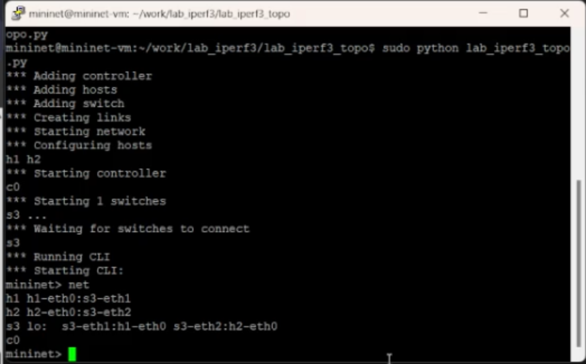
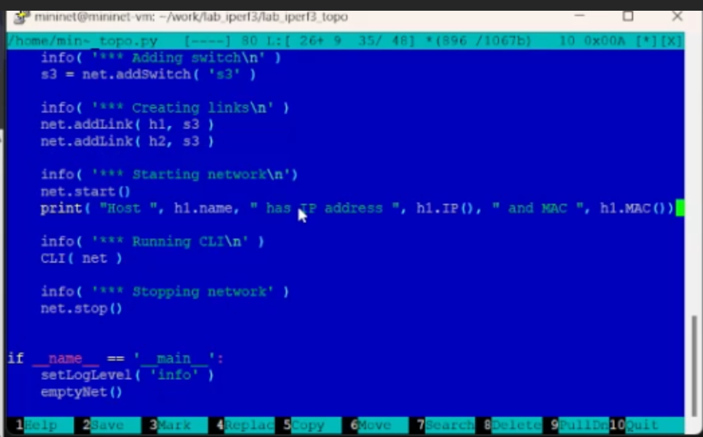
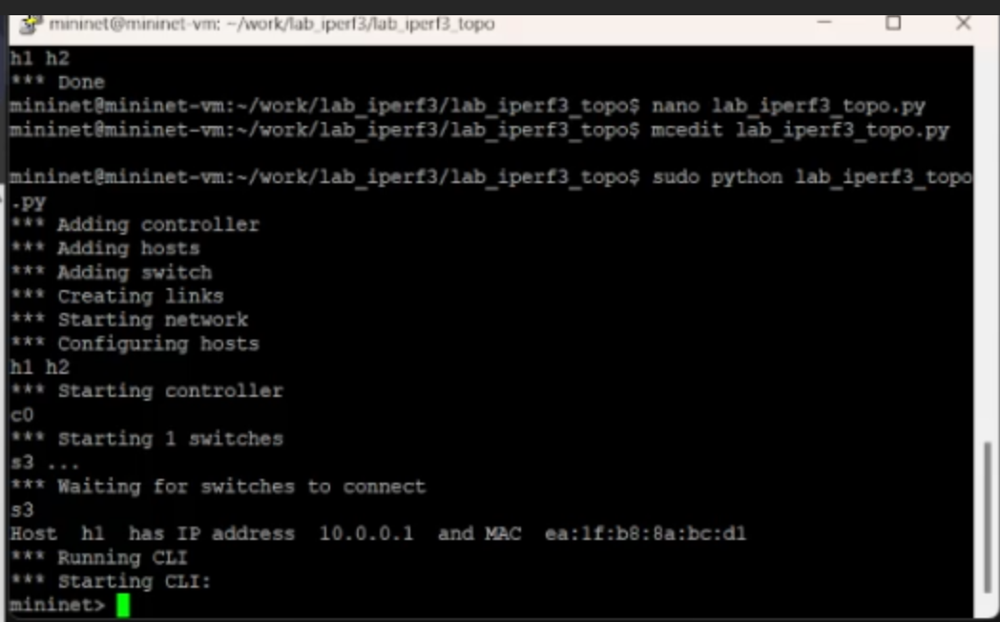
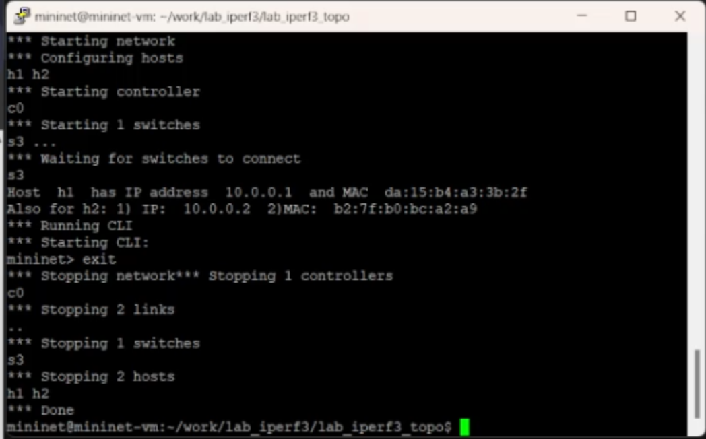
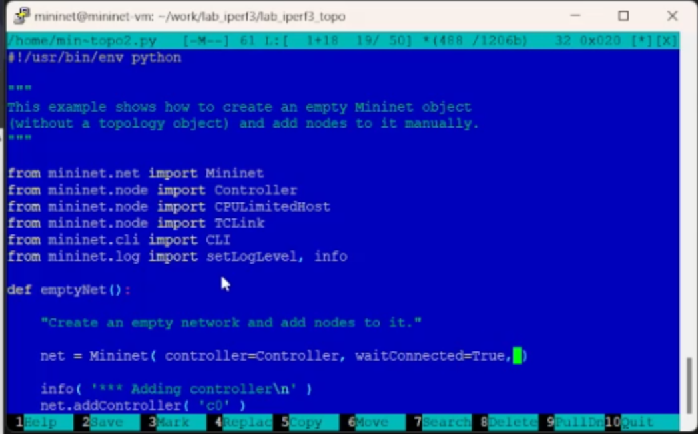
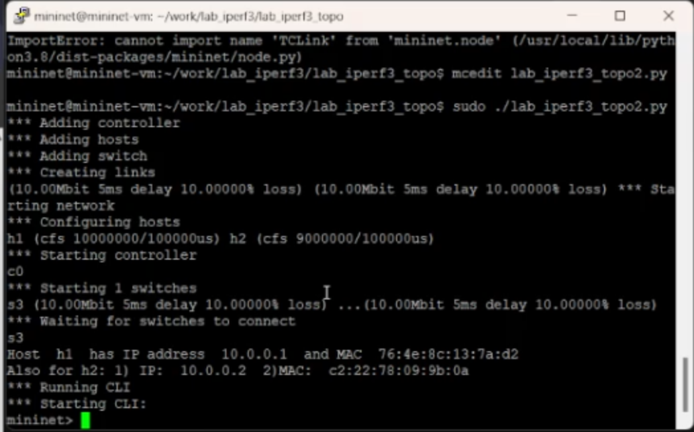
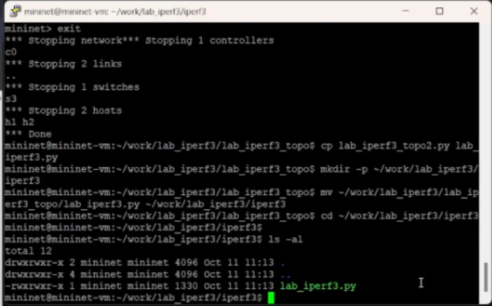
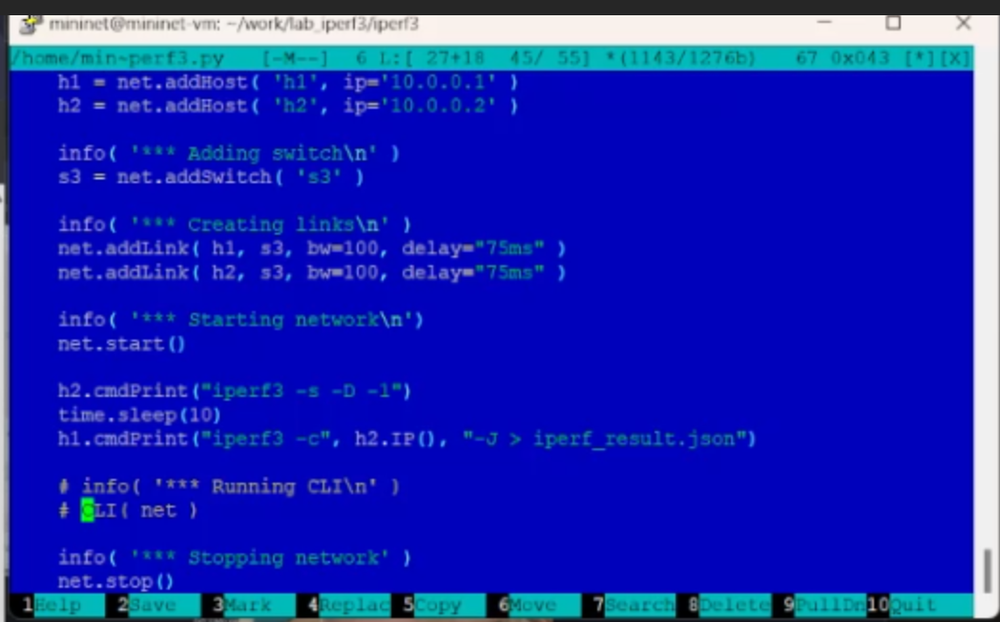
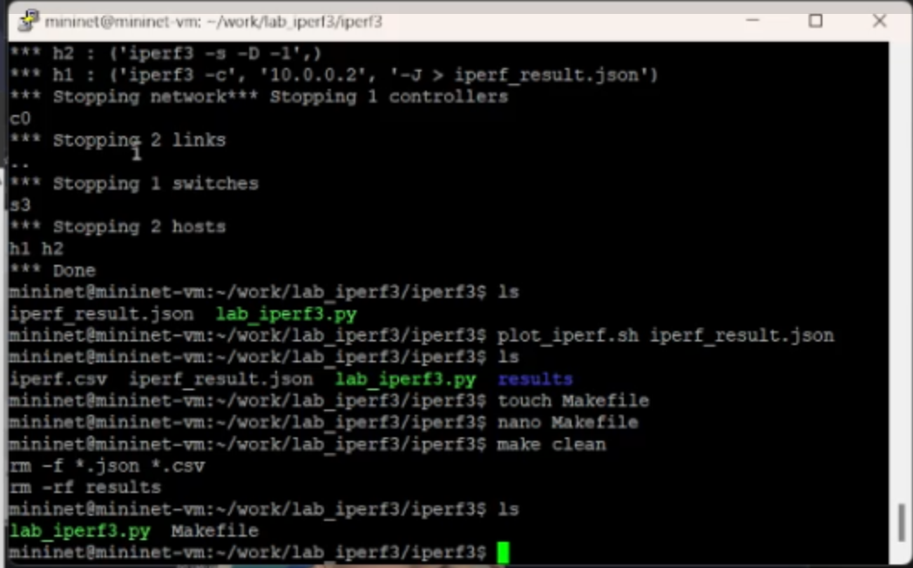

---
## Front matter
lang: ru-RU
title: Защита по лабораторной работе №3
subtitle: pf
author:
  - Чесноков Артемий Павлович
institute:
  - Российский университет дружбы народов, Москва, Россия
date: 15 марта 2025

## i18n babel
babel-lang: russian
babel-otherlangs: english

## Formatting pdf
toc: false
toc-title: Содержание
slide_level: 2
aspectratio: 169
section-titles: true
theme: metropolis
header-includes:
 - \metroset{progressbar=frametitle,sectionpage=progressbar,numbering=fraction}
---

# Информация

## Цель

Основной целью работы является знакомство с инструментом для измерения
пропускной способности сети в режиме реального времени — iPerf3, а также
получение навыков проведения воспроизводимого эксперимента по измерению
пропускной способности моделируемой сети в среде Mininet.

## Создаем необходимые папки и копируем emptynet.py .

## Запускаем файл  .

## Смотрим все элементы топологии .

## В коде выводим IP&MAC адрес  .

## Запускаем отредактированную программу .

## Добавляем такое же отображение для 2 хоста .

## Запускаем отредактированную программу .

## Добавляем импорты CPULimitHost & TCLink .

## Расширяем net импортированными модулями .

## Добавляем ограничение CPU на хосты  .

## Запускаем код .

## Изменяем структуру .

## Выполняем iperf команды прямо в коде .

## Запускаем измененный код .

## Создаем Мэйкфайл и настраиваем его .

## Пробуем наш Мэйкфайл .

## Спасибо за внимание.
