---
## Front matter
lang: ru-RU
title: Защита по лабораторной работе №4
subtitle: pf
author:
  - Чесноков Артемий Павлович
institute:
  - Российский университет дружбы народов, Москва, Россия
date: 15 марта 2025

## i18n babel
babel-lang: russian
babel-otherlangs: english

## Formatting pdf
toc: false
toc-title: Содержание
slide_level: 2
aspectratio: 169
section-titles: true
theme: metropolis
header-includes:
 - \metroset{progressbar=frametitle,sectionpage=progressbar,numbering=fraction}
---

# Информация

## Цель

Основной целью работы является знакомство с NETEM — инструментом для
тестирования производительности приложений в виртуальной сети, а также
получение навыков проведения интерактивного и воспроизводимого экспериментов по измерению задержки и её дрожания (jitter) в моделируемой сети
в среде Mininet.

## Задаем простейшую топологию
{#fig:001 width=70%}

## Проверяем автоматическое выставление ip
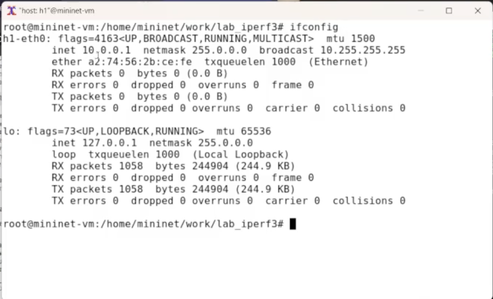{#fig:002 width=70%}

## Проверяем автоматическое выставление ip
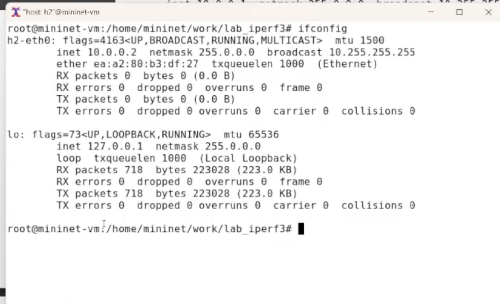{#fig:003 width=70%}

## Проверяем соединение
{#fig:004 width=70%}

## Задаем задержку на первый хост 100мс
{#fig:005 width=70%}

## Задаем задержку на второй хост
{#fig:006 width=70%}

## Проверяем задержку
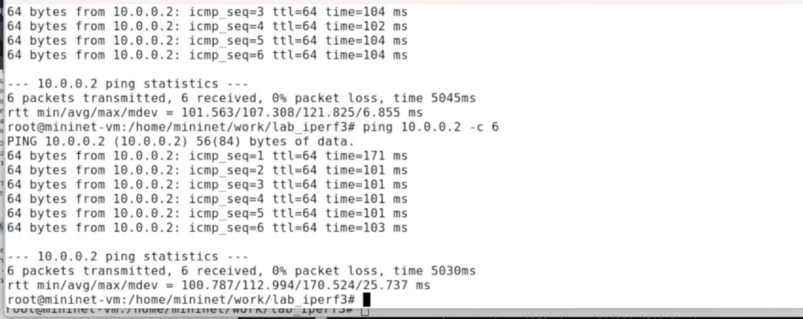{#fig:007 width=70%}

## Убираем задержку
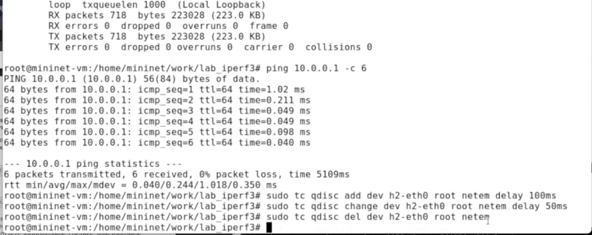{#fig:008 width=70%}

## Задержка убирается опцией del
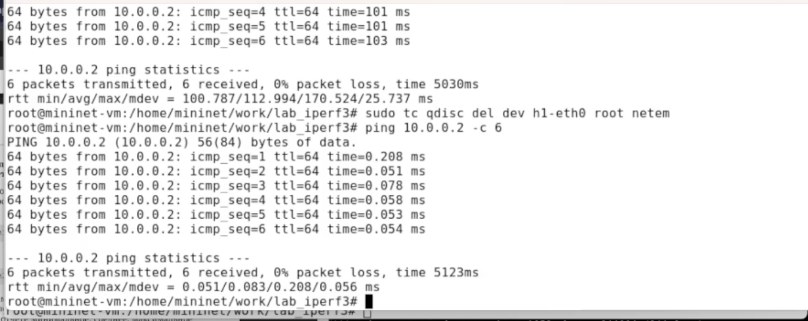{#fig:009 width=70%}

## Добавляем случайное отклонение 10мс
{#fig:010 width=70%}

## Добавляем корреляцию
{#fig:011 width=70%}

## Добавляем распределение
{#fig:012 width=70%}

## Обновляем пакеты, ставим geequi
{#fig:013 width=70%}

## Организовываем папочки
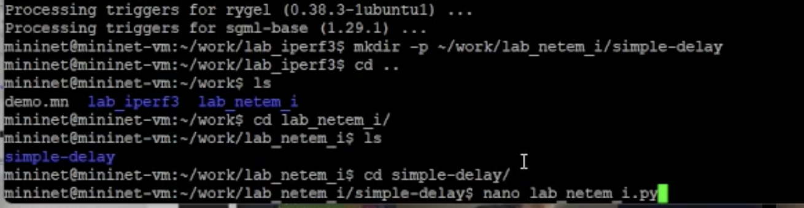{#fig:014 width=70%}

## Создали скрипт mininet топологии
{#fig:015 width=70%}

## Написали скрипт для gnu plot
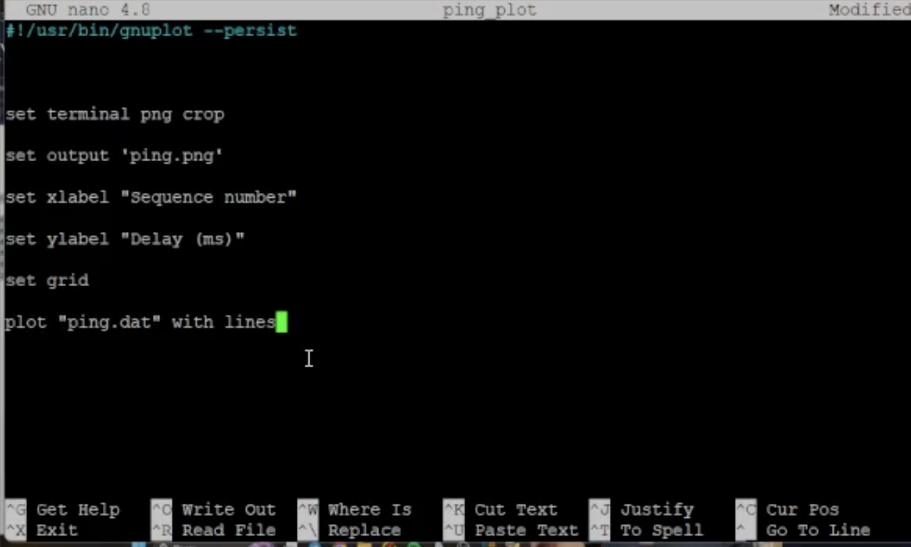{#fig:016 width=70%}

## написали makefile
{#fig:017 width=70%}

## Протестировали
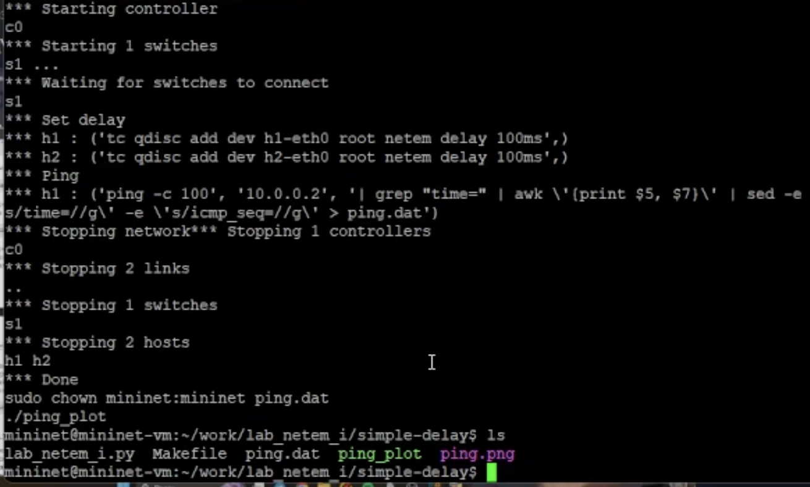{#fig:018 width=70%}

## Посмотрели график
{#fig:019 width=70%}

## Смотрим график при убранном из входных первого пакета
{#fig:020 width=70%}

## Скрипт для подсчёта метрик rtt
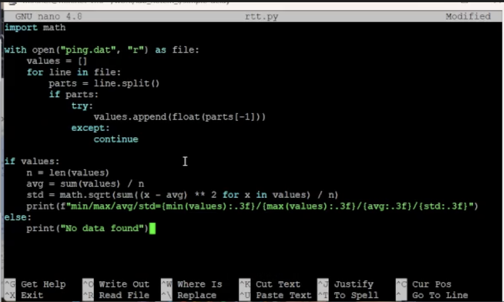{#fig:021 width=70%}

## Обновляем makefile
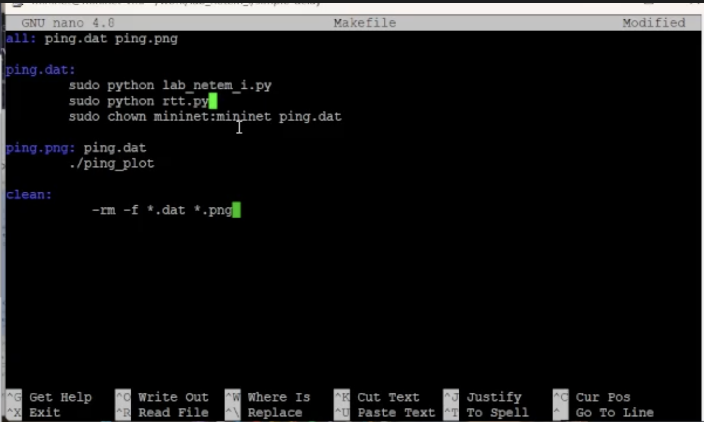{#fig:022 width=70%}

## Протестили
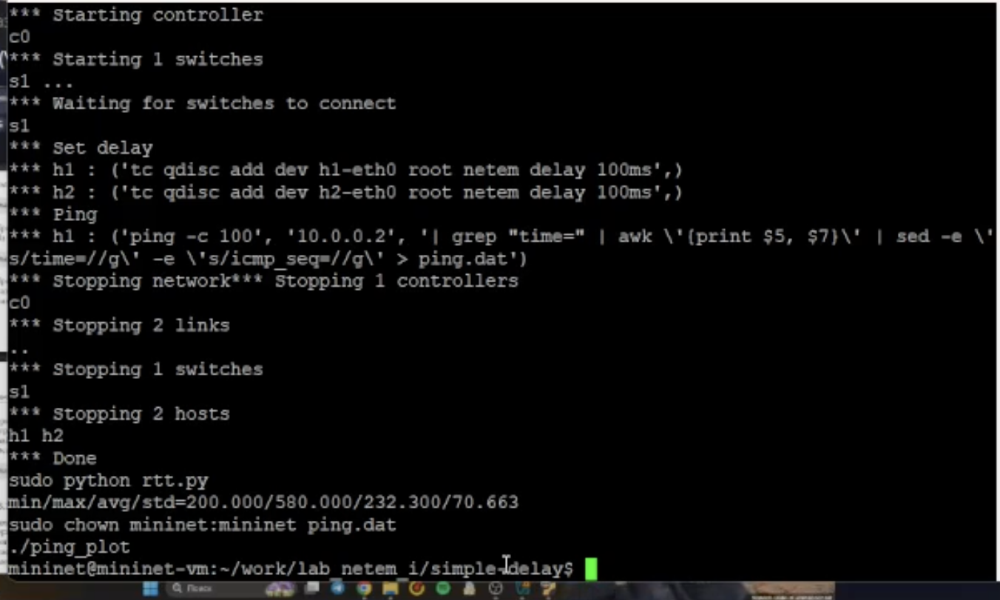{#fig:023 width=70%}

## Сделали папки для СР
{#fig:024 width=70%}

## Для демонстрации изменения задержки в дисц.очередей - делаем два прогона ping'а
{#fig:025 width=70%}

## запуск
{#fig:026 width=70%}

## график
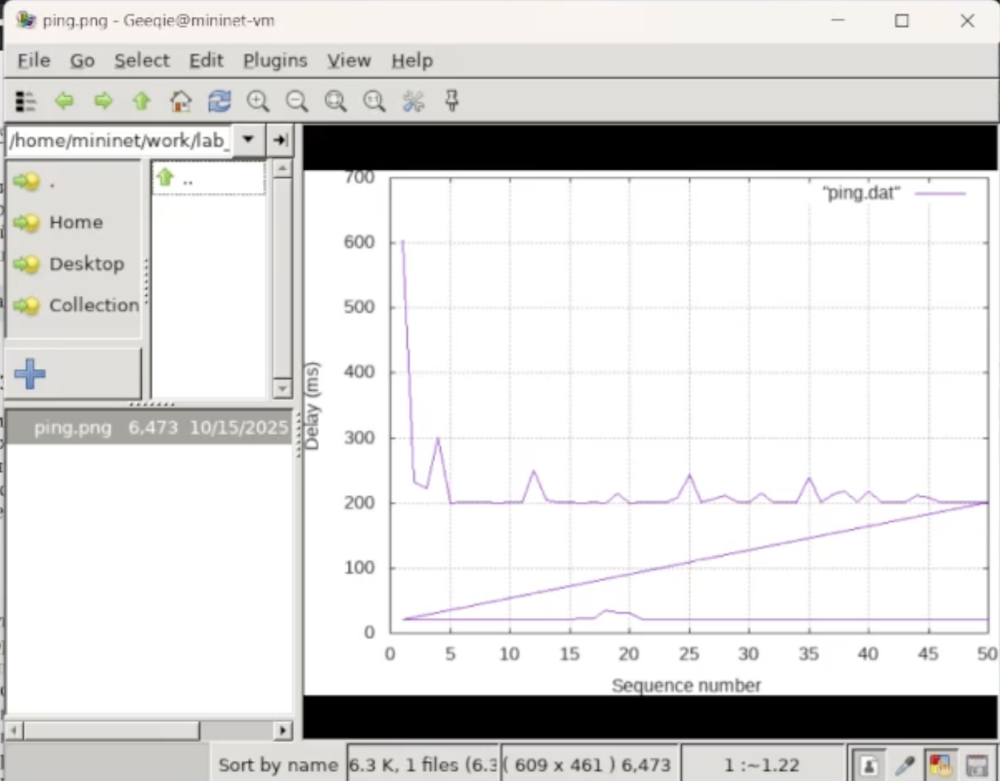{#fig:027 width=70%}

## Прогон с отклонением
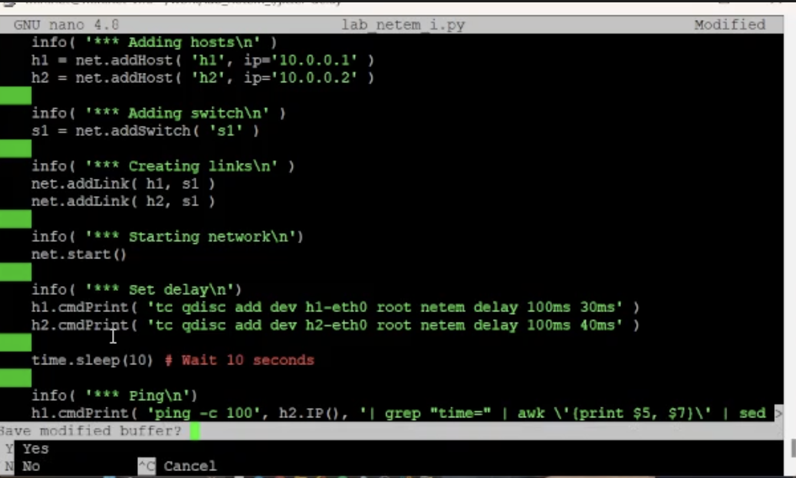{#fig:028 width=70%}

## запуск с отклонением
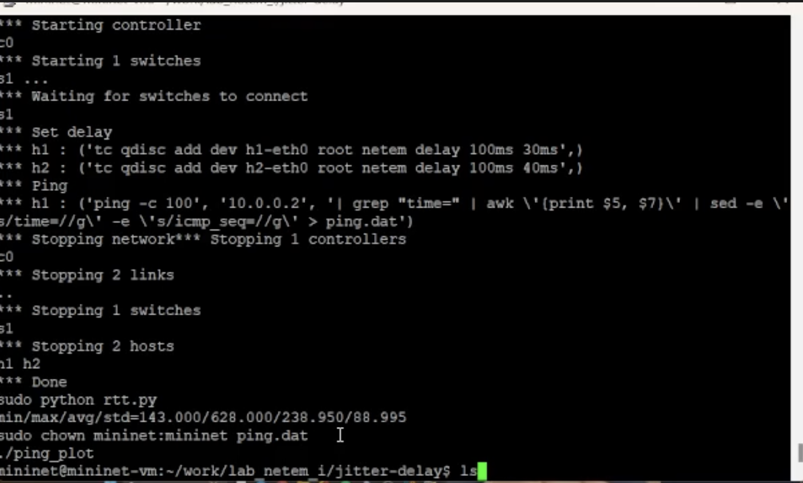{#fig:029 width=70%}

## график
{#fig:030 width=70%}

## прогон с корреляцией
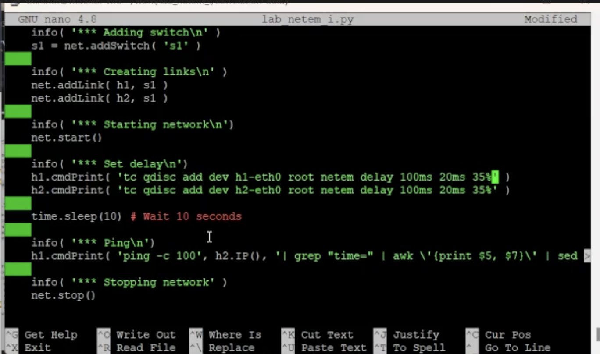{#fig:031 width=70%}

## запуск топологии
{#fig:032 width=70%}

## plot
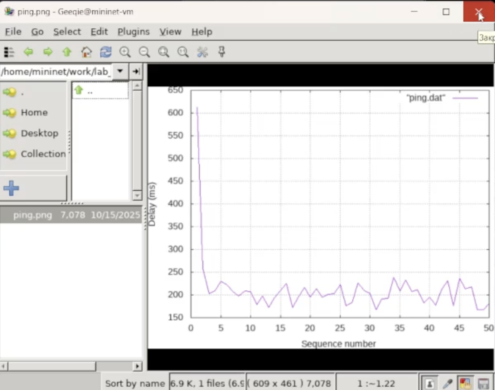{#fig:033 width=70%}

## Прогон с паретовским распределением
{#fig:034 width=70%}

## execution
{#fig:035 width=70%}

## plot
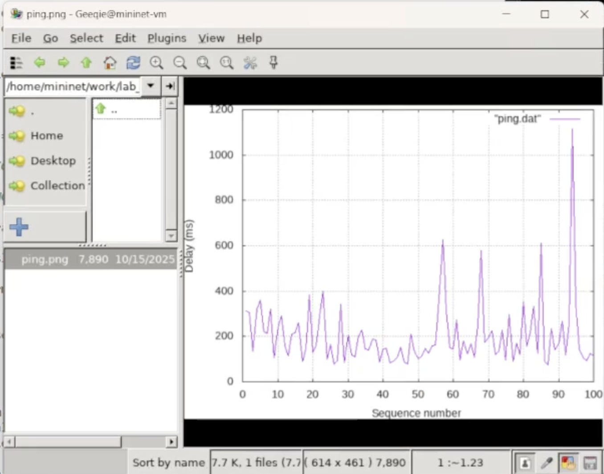{#fig:036 width=70%}

## Спасибо за внимание.
