---
## Front matter
title: "Отчёт по лабораторной работе №4"
subtitle: "НПИбд-02-22"
author: "Чесноков Артемий Павлович"

## Generic otions
lang: ru-RU
toc-title: "Содержание"

## Bibliography
bibliography: bib/cite.bib
csl: pandoc/csl/gost-r-7-0-5-2008-numeric.csl

## Pdf output format
toc: true # Table of contents
toc-depth: 2
lof: true # List of figures
lot: true # List of tables
fontsize: 12pt
linestretch: 1.5
papersize: a4
documentclass: scrreprt
## I18n polyglossia
polyglossia-lang:
  name: russian
  options:
	- spelling=modern
	- babelshorthands=true
polyglossia-otherlangs:
  name: english
## I18n babel
babel-lang: russian
babel-otherlangs: english
## Fonts
mainfont: IBM Plex Serif
romanfont: IBM Plex Serif
sansfont: IBM Plex Sans
monofont: IBM Plex Mono
mathfont: STIX Two Math
mainfontoptions: Ligatures=Common,Ligatures=TeX,Scale=0.94
romanfontoptions: Ligatures=Common,Ligatures=TeX,Scale=0.94
sansfontoptions: Ligatures=Common,Ligatures=TeX,Scale=MatchLowercase,Scale=0.94
monofontoptions: Scale=MatchLowercase,Scale=0.94,FakeStretch=0.9
mathfontoptions:
## Biblatex
biblatex: true
biblio-style: "gost-numeric"
biblatexoptions:
  - parentracker=true
  - backend=biber
  - hyperref=auto
  - language=auto
  - autolang=other*
  - citestyle=gost-numeric
## Pandoc-crossref LaTeX customization
figureTitle: "Рис."
tableTitle: "Таблица"
listingTitle: "Листинг"
lofTitle: "Список иллюстраций"
lotTitle: "Список таблиц"
lolTitle: "Листинги"
## Misc options
indent: true
header-includes:
  - \usepackage{indentfirst}
  - \usepackage{float} # keep figures where there are in the text
  - \floatplacement{figure}{H} # keep figures where there are in the text
---

# Цель работы

Основной целью работы является знакомство с NETEM — инструментом для
тестирования производительности приложений в виртуальной сети, а также
получение навыков проведения интерактивного и воспроизводимого экспериментов по измерению задержки и её дрожания (jitter) в моделируемой сети
в среде Mininet.

# Выполнение лабораторной работы

Задаем простейшую топологию (рис. [-@fig:001]).

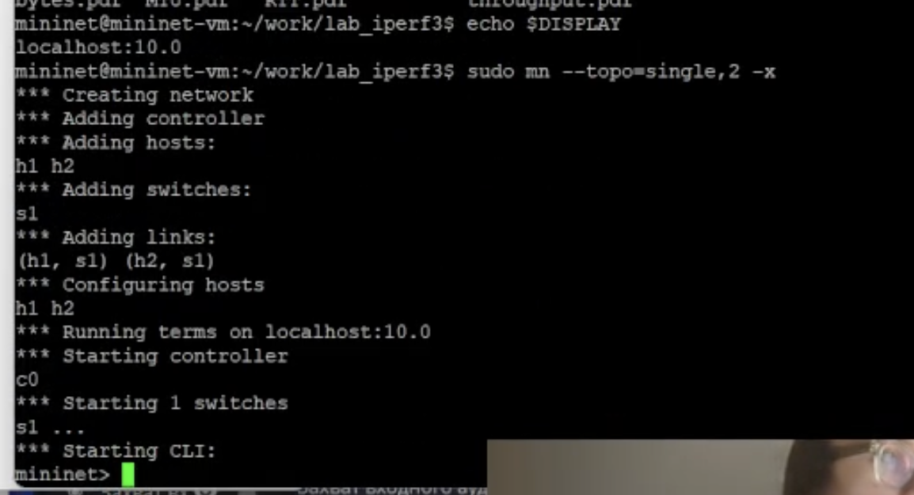{#fig:001 width=70%}

Проверяем автоматическое выставление ip (рис. [-@fig:002]).

{#fig:002 width=70%}

Проверяем автоматическое выставление ip (рис. [-@fig:003]).

{#fig:003 width=70%}

Проверяем соединение (рис. [-@fig:004]).

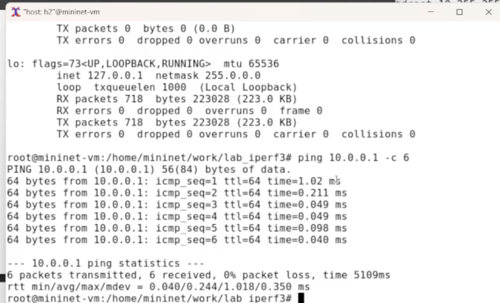{#fig:004 width=70%}

Задаем задержку на первый хост 100мс (рис. [-@fig:005]).

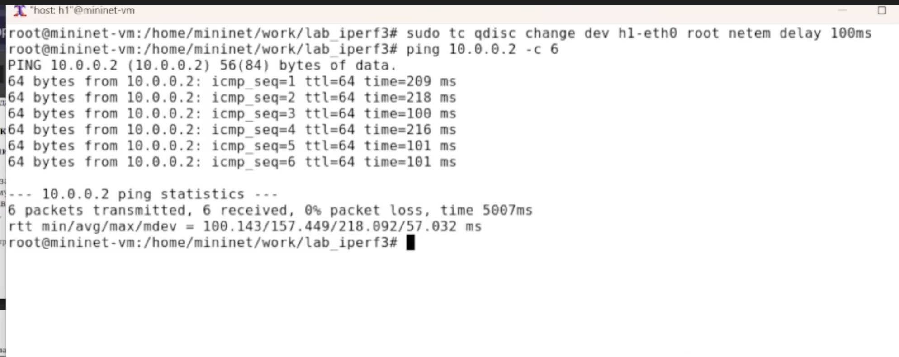{#fig:005 width=70%}

Задаем задержку на второй хост (рис. [-@fig:006]).

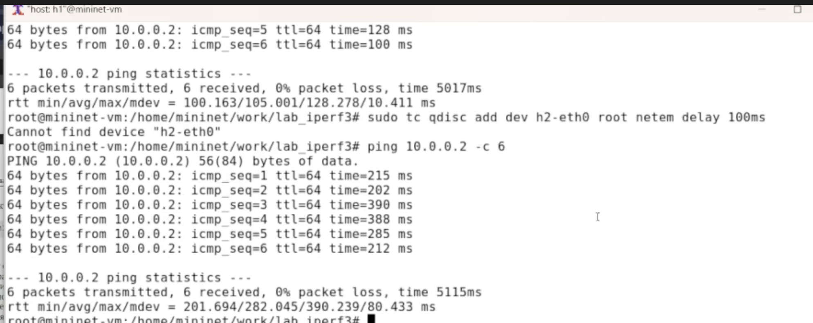{#fig:006 width=70%}

Проверяем задержку (рис. [-@fig:007]).

{#fig:007 width=70%}

Убираем задержку (рис. [-@fig:008]).

{#fig:008 width=70%}

Задержка убирается опцией del (рис. [-@fig:009]).

{#fig:009 width=70%}

Добавляем случайное отклонение 10мс

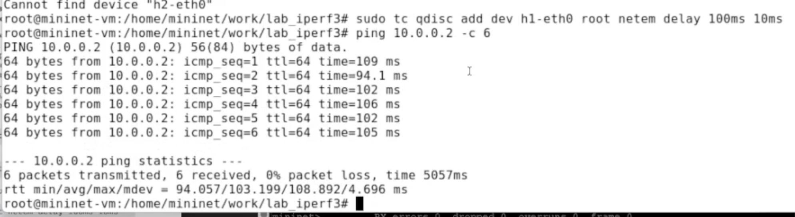{#fig:010 width=70%}

Добавляем корреляцию

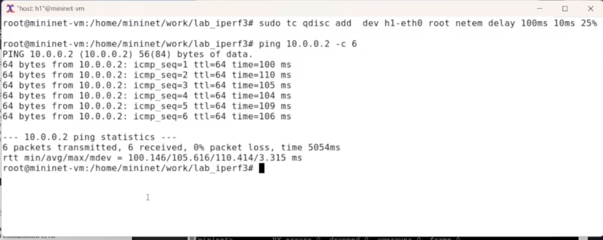{#fig:011 width=70%}

Добавляем распределение

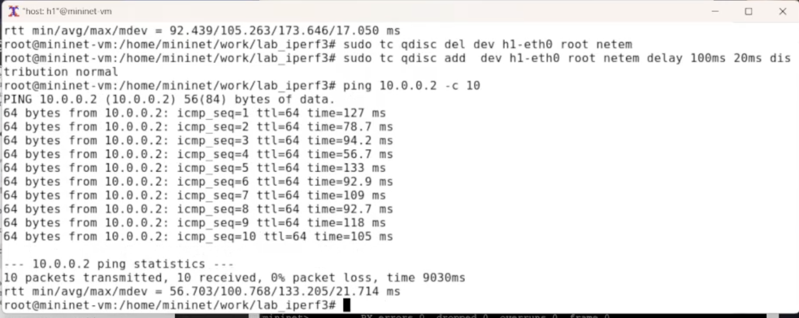{#fig:012 width=70%}

Обновляем пакеты, ставим geequi

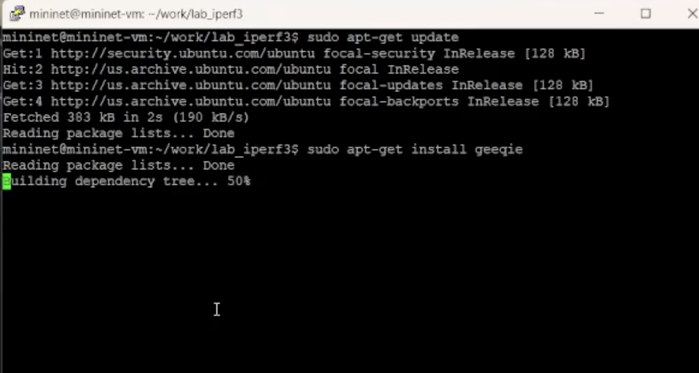{#fig:013 width=70%}

Организовываем папочки

{#fig:014 width=70%}

Создали скрипт mininet топологии

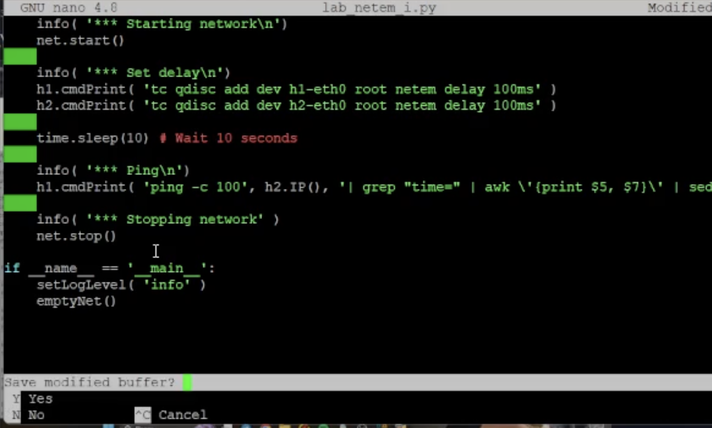{#fig:015 width=70%}

Написали скрипт для gnu plot

{#fig:016 width=70%}

написали makefile 

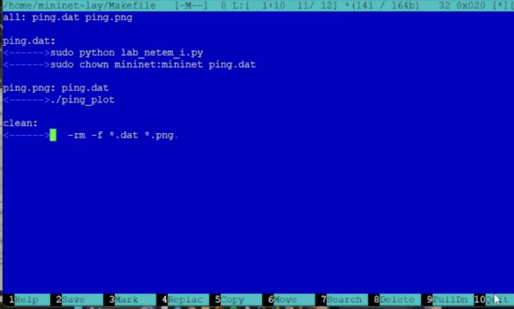{#fig:017 width=70%}

Протестировали

{#fig:018 width=70%}

Посмотрели график

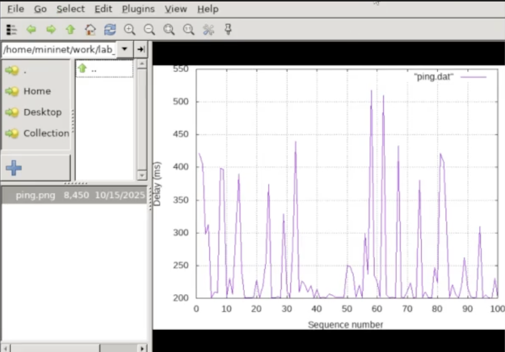{#fig:019 width=70%}

Смотрим график при убранном из входных первого пакета

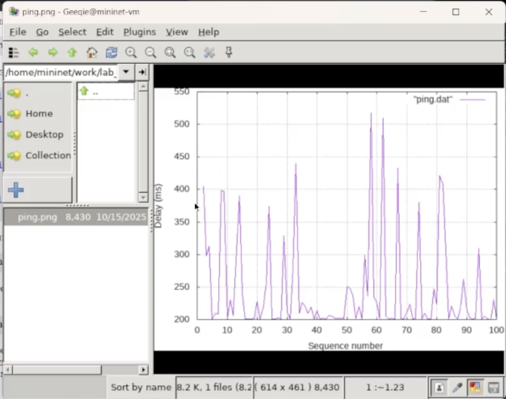{#fig:020 width=70%}

Скрипт для подсчёта метрик rtt

{#fig:021 width=70%}

Обновляем makefile

{#fig:022 width=70%}

Протестили

{#fig:023 width=70%}

Сделали папки для СР

{#fig:024 width=70%}

Для демонстрации изменения задержки в дисц.очередей - делаем два прогона ping'а

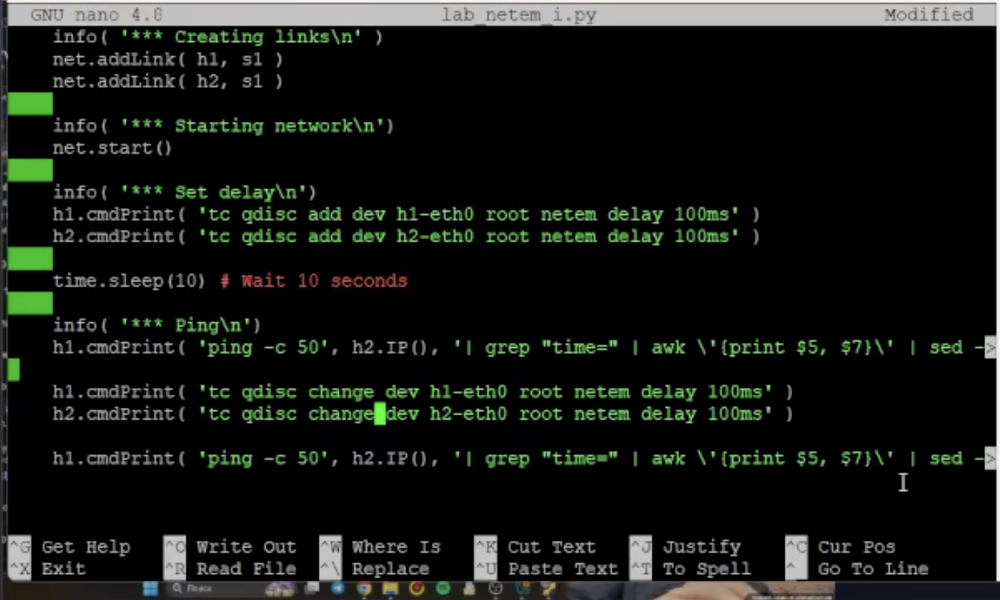{#fig:025 width=70%}

запуск

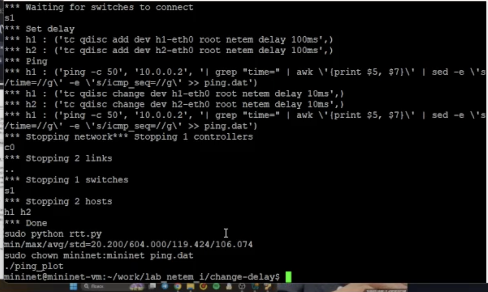{#fig:026 width=70%}

график

{#fig:027 width=70%}

Прогон с отклонением

{#fig:028 width=70%}

запуск с отклонением

{#fig:029 width=70%}

график

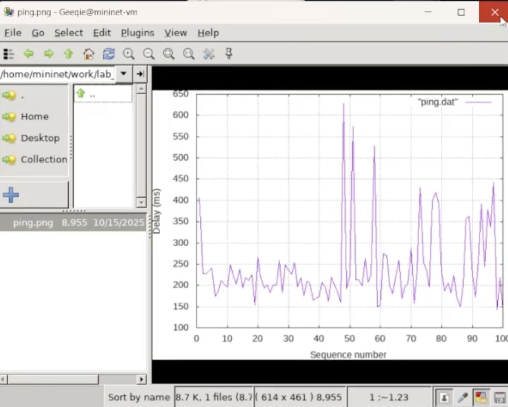{#fig:030 width=70%}

прогон с корреляцией

{#fig:031 width=70%}

запуск топологии

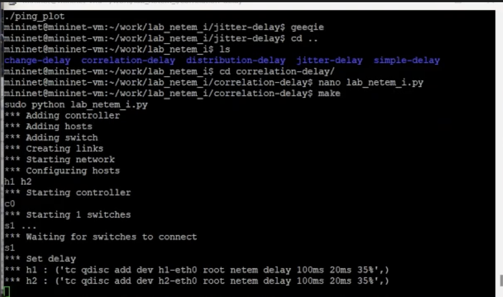{#fig:032 width=70%}

plot

{#fig:033 width=70%}

Прогон с паретовским распределением

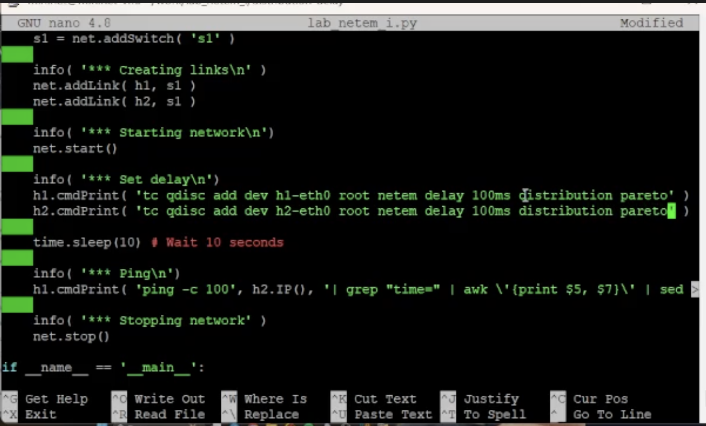{#fig:034 width=70%}

execution

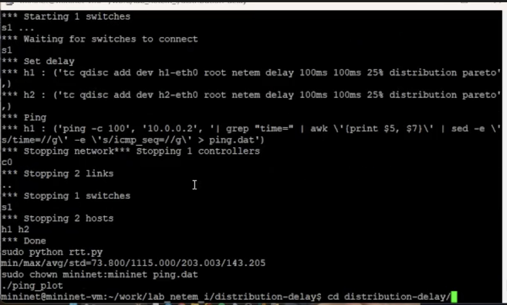{#fig:035 width=70%}

plot

{#fig:036 width=70%}

# Выводы

Познакомились с NETEM, а также
получили навыки проведения интерактивного и воспроизводимого экспериментов по измерению задержки и её дрожания (jitter) в моделируемой сети
в среде Mininet.

# Список литературы{.unnumbered}

::: {#refs}
:::
