---
## Front matter
title: "Отчёт по лабораторной работе №5"
subtitle: "НПИбд-02-22"
author: "Чесноков Артемий Павлович"

## Generic otions
lang: ru-RU
toc-title: "Содержание"

## Bibliography
bibliography: bib/cite.bib
csl: pandoc/csl/gost-r-7-0-5-2008-numeric.csl

## Pdf output format
toc: true # Table of contents
toc-depth: 2
lof: true # List of figures
lot: true # List of tables
fontsize: 12pt
linestretch: 1.5
papersize: a4
documentclass: scrreprt
## I18n polyglossia
polyglossia-lang:
  name: russian
  options:
	- spelling=modern
	- babelshorthands=true
polyglossia-otherlangs:
  name: english
## I18n babel
babel-lang: russian
babel-otherlangs: english
## Fonts
mainfont: IBM Plex Serif
romanfont: IBM Plex Serif
sansfont: IBM Plex Sans
monofont: IBM Plex Mono
mathfont: STIX Two Math
mainfontoptions: Ligatures=Common,Ligatures=TeX,Scale=0.94
romanfontoptions: Ligatures=Common,Ligatures=TeX,Scale=0.94
sansfontoptions: Ligatures=Common,Ligatures=TeX,Scale=MatchLowercase,Scale=0.94
monofontoptions: Scale=MatchLowercase,Scale=0.94,FakeStretch=0.9
mathfontoptions:
## Biblatex
biblatex: true
biblio-style: "gost-numeric"
biblatexoptions:
  - parentracker=true
  - backend=biber
  - hyperref=auto
  - language=auto
  - autolang=other*
  - citestyle=gost-numeric
## Pandoc-crossref LaTeX customization
figureTitle: "Рис."
tableTitle: "Таблица"
listingTitle: "Листинг"
lofTitle: "Список иллюстраций"
lotTitle: "Список таблиц"
lolTitle: "Листинги"
## Misc options
indent: true
header-includes:
  - \usepackage{indentfirst}
  - \usepackage{float} # keep figures where there are in the text
  - \floatplacement{figure}{H} # keep figures where there are in the text
---

# Цель работы

Основной целью работы является получение навыков проведения интерактивных экспериментов в среде Mininet по исследованию параметров сети,
связанных с потерей, дублированием, изменением порядка и повреждением
пакетов при передаче данных. Эти параметры влияют на производительность
протоколов и сетей.

# Выполнение лабораторной работы

Подключаемся к виртуалке, предварительно её включив (рис. [-@fig:001]).

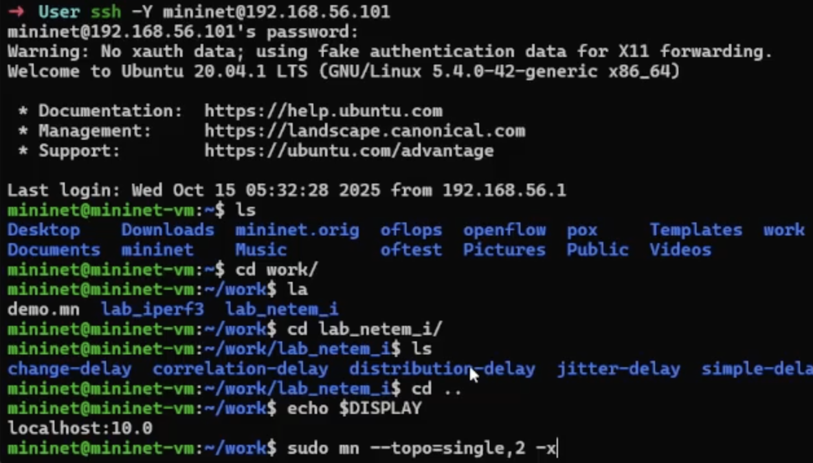{#fig:001 width=70%}

Проверяем соединение (рис. [-@fig:002]).

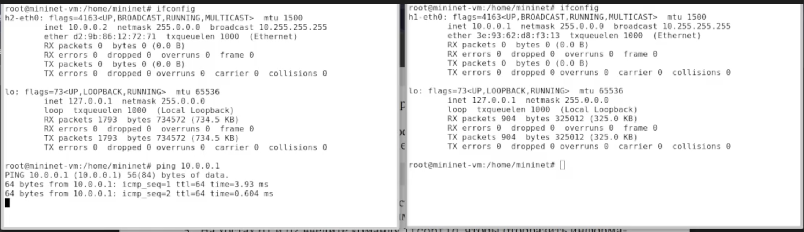{#fig:002 width=70%}

Пингуем с потерями (рис. [-@fig:003]).

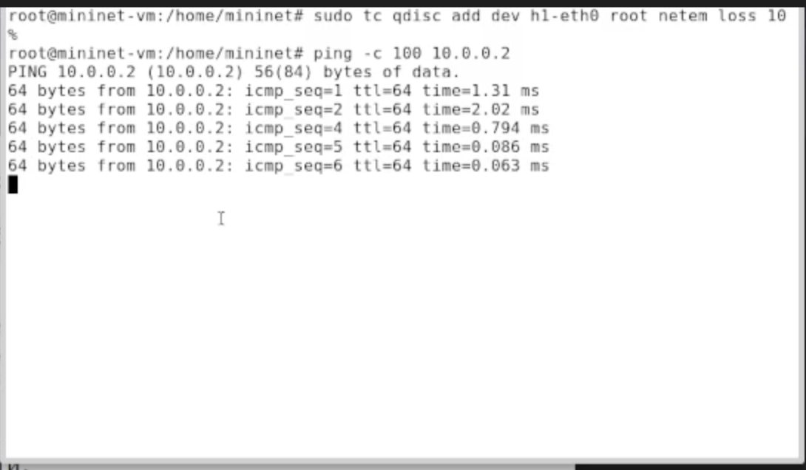{#fig:003 width=70%}

Наблюдаем те самые потери (рис. [-@fig:004]).

{#fig:004 width=70%}

Добавим так же потери на стороне получателя пинга (рис. [-@fig:005]).

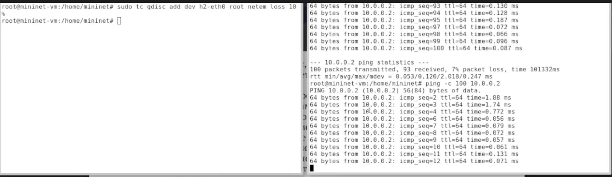{#fig:005 width=70%}

Наблюдаем потери (рис. [-@fig:006]).

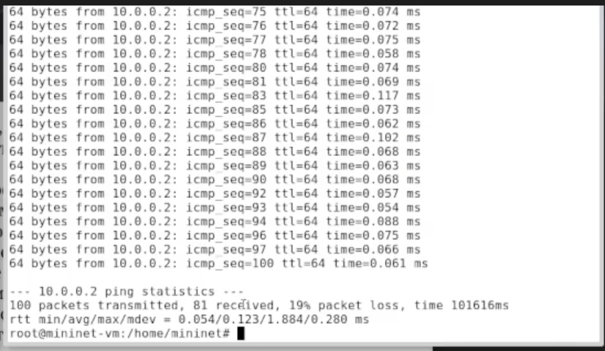{#fig:006 width=70%}

Убираем задержки (рис. [-@fig:007]).

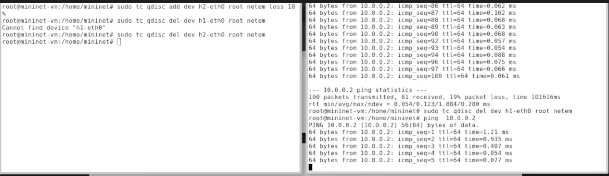{#fig:007 width=70%}

Добавляем зависимость пакета на 50% от предыдущего (рис. [-@fig:008]).

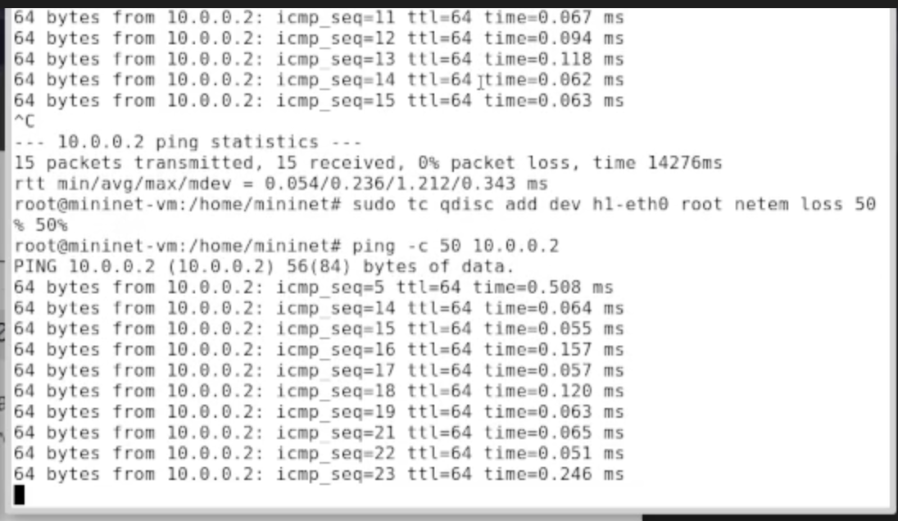{#fig:008 width=70%}

Итоги - 68% потерь! Ужас! (рис. [-@fig:009]).

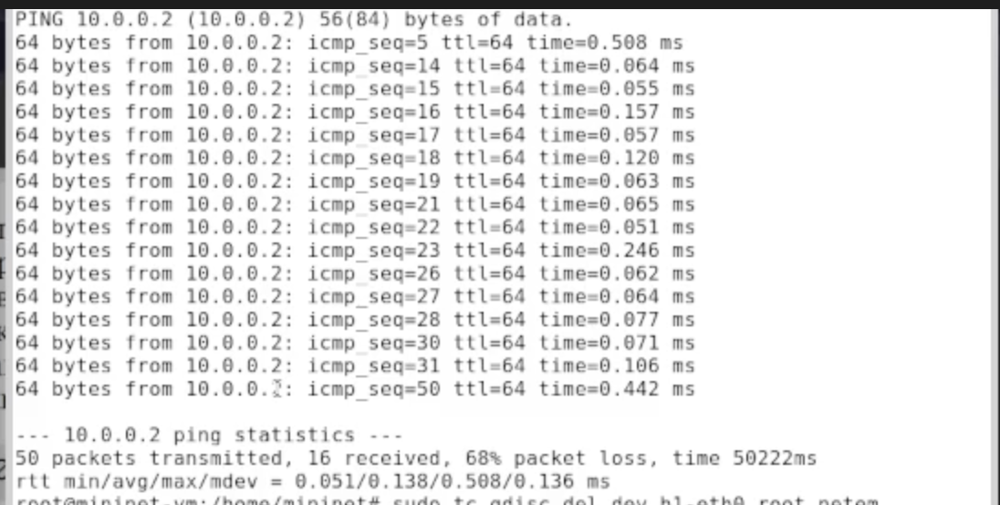{#fig:009 width=70%}

Для проверки повреждения - поднимаем iPerf  (рис. [-@fig:010]).

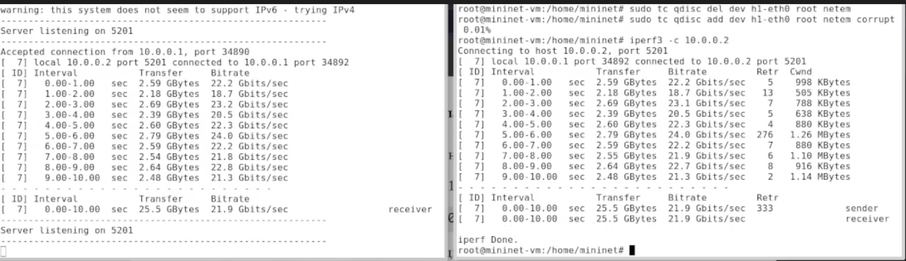{#fig:010 width=70%}

Убираем повреждения и наблюдаем 0 ретраев  (рис. [-@fig:011]).

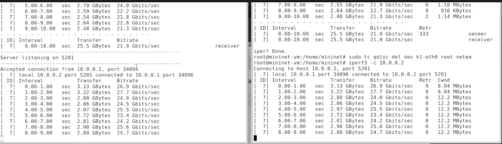{#fig:011 width=70%}

Добавляем переупорядочивание пакетов  (рис. [-@fig:012]).

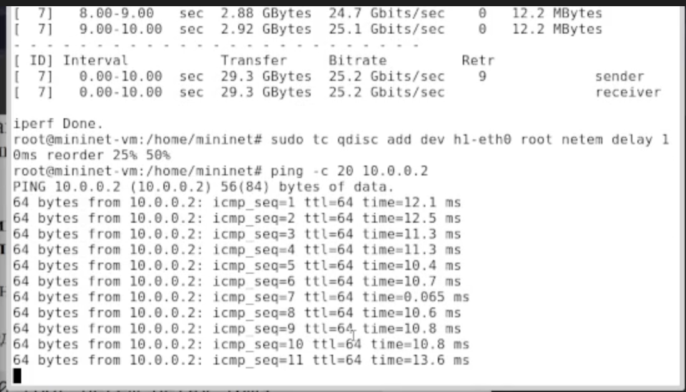{#fig:012 width=70%}

Обновим правила, добавив дублирование  (рис. [-@fig:013]).

{#fig:013 width=70%}

Создаем директорию для воспроизводимого эксперимента  (рис. [-@fig:014]).

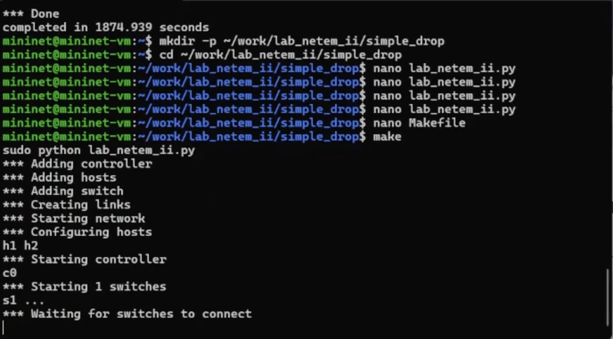{#fig:014 width=70%}

Результаты запуска  (рис. [-@fig:015]).

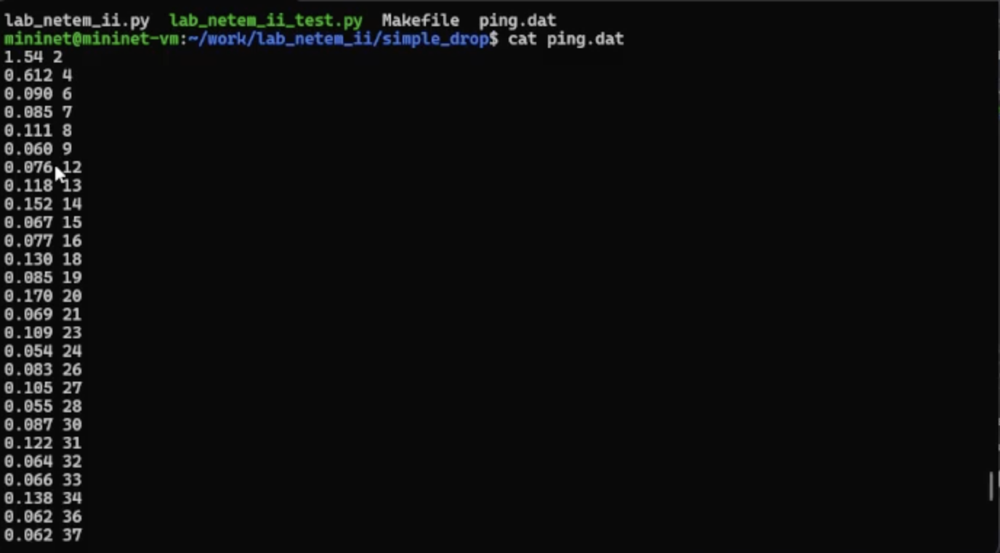{#fig:015 width=70%}

Подготовим инфраструктуру для остальных экспериментов  (рис. [-@fig:016]).

{#fig:016 width=70%}

Правим код, добавляя корреляцию (рис. [-@fig:017]).

{#fig:017 width=70%}

Наблюдаем результаты  (рис. [-@fig:018]).

{#fig:018 width=70%}

Чтобы проверить повреждения пакетов добавляем в логику кода - iperf  (рис. [-@fig:019]).

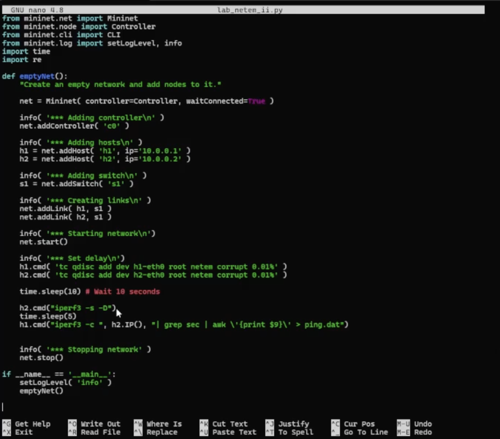{#fig:019 width=70%}

Делаем код для переупорядочивания (рис. [-@fig:020]).

{#fig:020 width=70%}

Наблюдаем результат  (рис. [-@fig:021]).

{#fig:021 width=70%}

# Выводы

В рамках выполнения лабораторной работы получили навыки проведения интерактивных экспериментов в среде Mininet по исследованию параметров сети,
связанных с потерей, дублированием, изменением порядка и повреждением
пакетов при передаче данных. Эти параметры влияют на производительность
протоколов и сетей.

# Список литературы{.unnumbered}

::: {#refs}
:::
