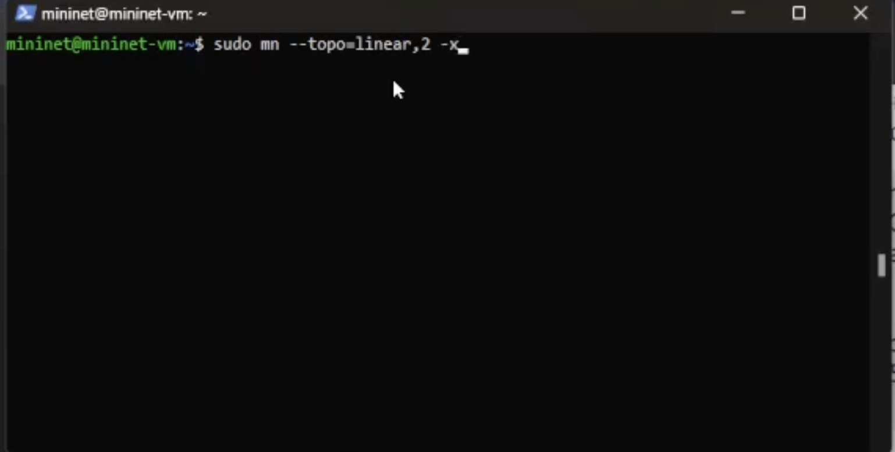
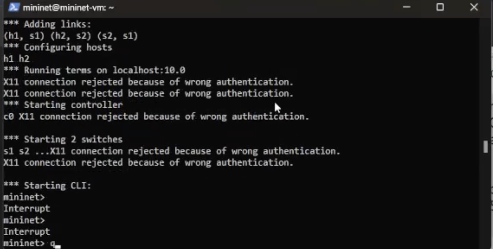
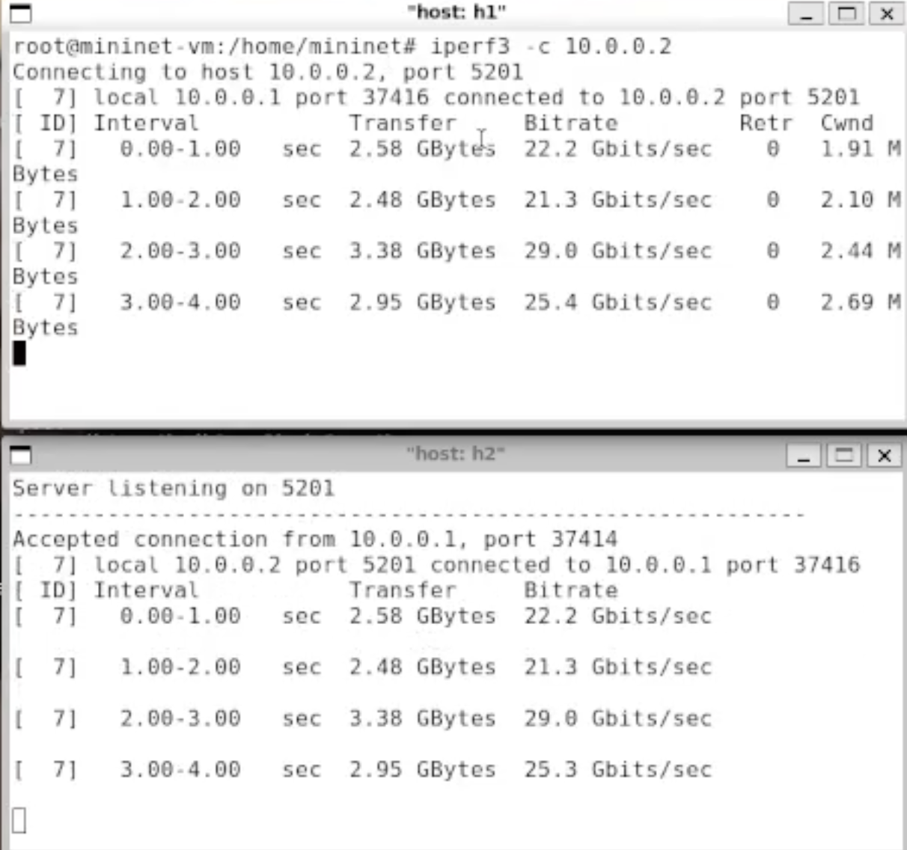
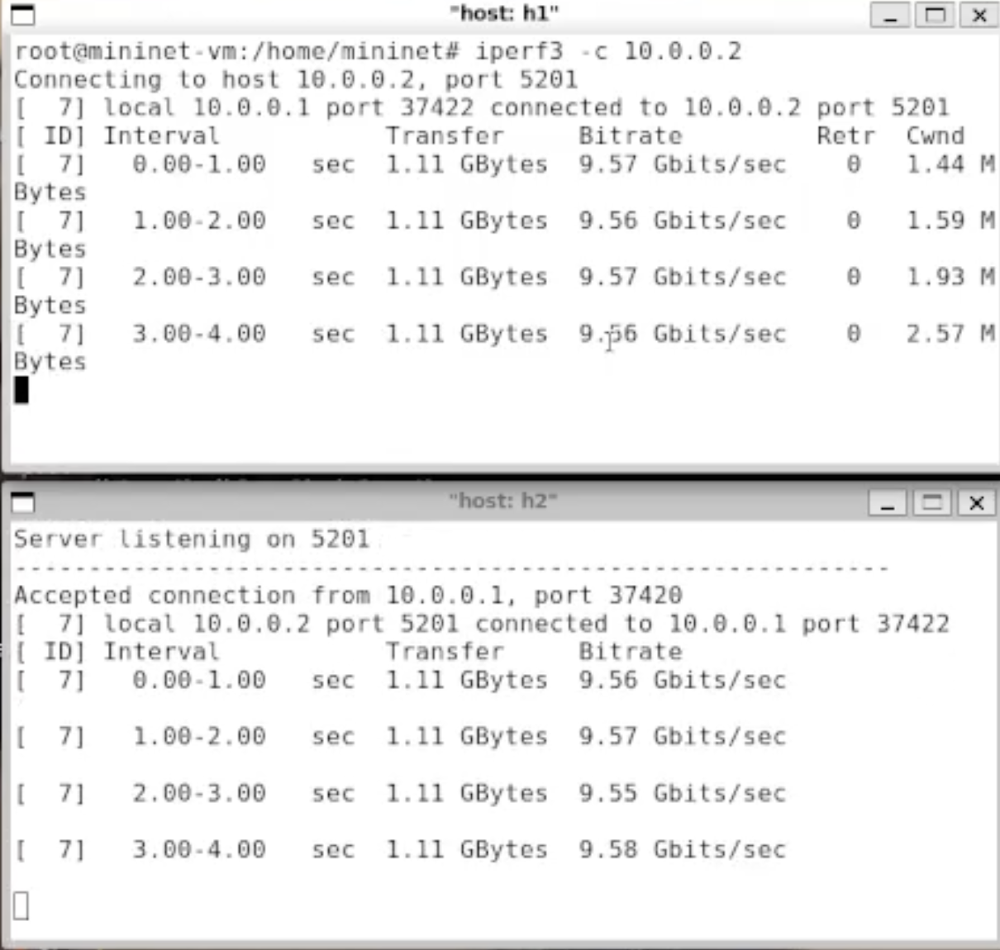
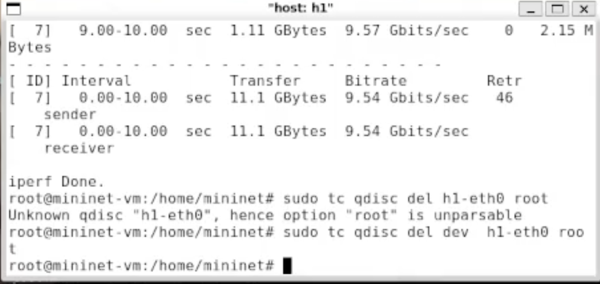
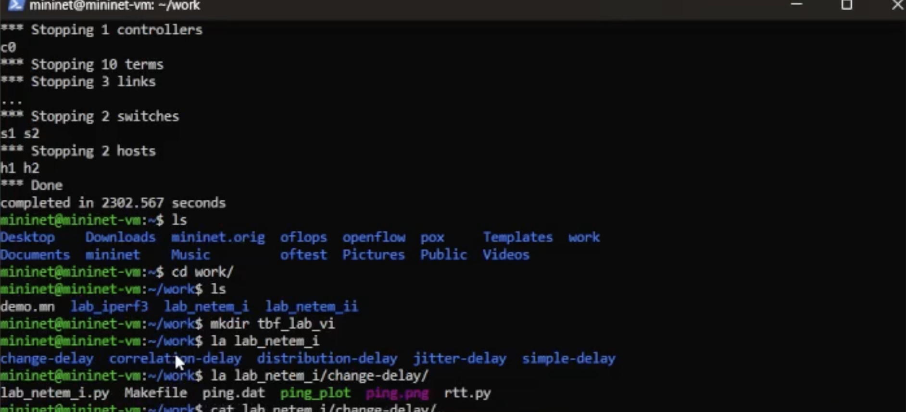
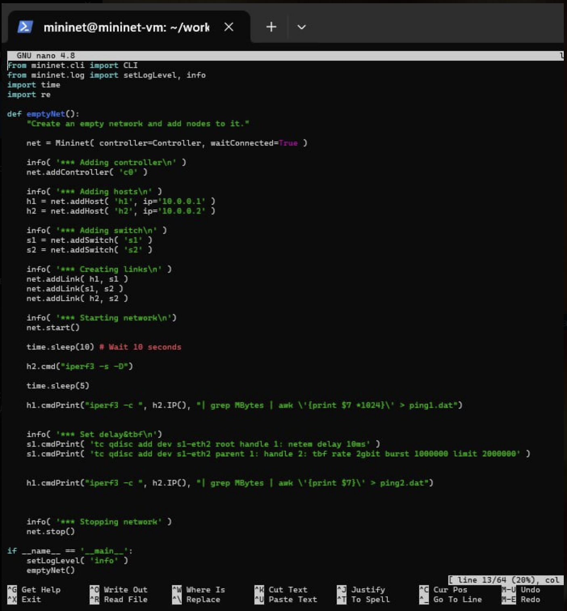

---
## Front matter
lang: ru-RU
title: Дисциплина очереди Token Bucket Filter
subtitle: Лабораторная работа №6
author:
  - Чесноков Артемий Павлович
institute:
  - Российский университет дружбы народов, Москва, Россия
  - факультет физико-математических и естественных наук
date: 18 февраля 2023

## i18n babel
babel-lang: russian
babel-otherlangs: english

## Formatting pdf
toc: false
toc-title: Содержание
slide_level: 2
aspectratio: 169
section-titles: true
theme: metropolis
header-includes:
 - \metroset{progressbar=frametitle,sectionpage=progressbar,numbering=fraction}
 - '\makeatletter'
 - '\beamer@ignorenonframefalse'
 - '\makeatother'
---

# Информация

## Докладчик

:::::::::::::: {.columns align=center}
::: {.column width="70%"}

  * Чесноков Артемий Павлович
  * Студент, первый курс
  * Студент НПИбд-02-22
  * Российский университет дружбы народов
  * [1132222012@pfur.ru](1132222012@pfur.ru)
  * <https://github.com/Sinabon2004/study_2022-2023_os-intro>

:::
::: {.column width="30%"}

:::
::::::::::::::

## Цель работы

- Знакомство с принципами работы дисциплины очереди Token Bucket Filter
- Формирование входящего/исходящего трафика для ограничения пропускной способности
- Получение навыков моделирования и исследования поведения трафика
- Проведение интерактивного и воспроизводимого экспериментов в Mininet

# Выполнение лабораторной работы

## Создание линейной топологии (рис. @fig:001)

{#fig:001 width=70%}

## Проблема с X11 (рис. @fig:002)

{#fig:002 width=70%}

## Обновление куки (рис. @fig:003)

{#fig:003 width=70%}

## Проверка адресов (рис. @fig:004)

{#fig:004 width=70%}

## Проверка соединения (рис. @fig:005)

{#fig:005 width=70%}

## Фиксация текущего битрейта (рис. @fig:006)

{#fig:006 width=70%}

## Создание tbf правила (рис. @fig:007)

{#fig:007 width=70%}

## Проверка пропускной способности (рис. @fig:008)

{#fig:008 width=70%}

## Удаление правила с хоста (рис. @fig:009)

{#fig:009 width=70%}

## Правило на сетевом устройстве (рис. @fig:010)

{#fig:010 width=70%}

## Удаление правила с коммутатора (рис. @fig:011)

{#fig:011 width=70%}

## Создание сложных правил (рис. @fig:012)

{#fig:012 width=70%}

## Воспроизводимый эксперимент (рис. @fig:013)

{#fig:013 width=70%}

## Поиск нужного шаблона (рис. @fig:014)

{#fig:014 width=70%}

## Редактирование скрипта топологии (рис. @fig:015)

{#fig:015 width=70%}

## Редактирование скрипта графика (рис. @fig:016)

{#fig:016 width=70%}

## Результат (рис. @fig:017)

{#fig:017 width=70%}

# Выводы

## Итоговый слайд

- Познакомились с алгоритмом TBF
- Освоили построение сложных правил в дисциплине очередей (netem + tbf)

